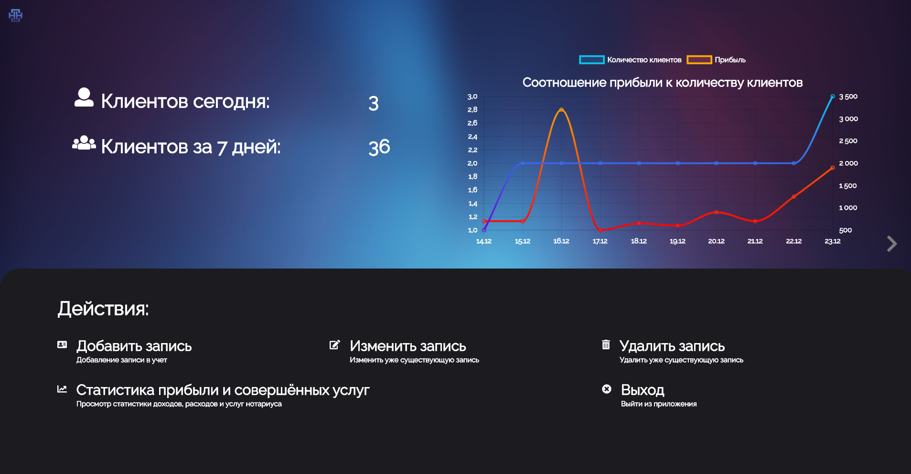

<div id="top"></div>

# NotaryTrack Program
This is a program for notary affair.


### Programming language, libraries and frameworks: 
* JavaScript
* [Electron](https://www.electronjs.org/)
* [Node adodb](https://github.com/nuintun/node-adodb)

### What this program can do:
* Add a new record;
* View daily and weekly statistics on the chart;
* More features coming soon...

### Advantages:
* Ability to explore and manage complete statistics thanks to various charts and built-in databases;
* Open source that allows you to customize the application to fit your needs;
* Stylish minimalist design that makes it easy to use the application: smile:
* Free access to the full functionality of the application.

### How to use
1. Clone the repository to local storage.
```sh
git clone https://github.com/samurai-of-honor/kursach.git
```
2. Installing NPM modules:
```sh
npm i
```
3. To run the program use:
```sh
npm run start
```
4. To compile the program and create an installation file, use:
```sh
npm run make
```

### Road map
- [x] Create the main page of the application
- [x] Add a page with additional information
- [x] Add the ability to add a new record to the database
- [ ] Add the ability to change and delete records in the database
- [ ] Add an annual report
- [ ] Add a page with graphs and statistics
- [ ] Ukrainian
- [ ] English

### Contributors
* [Negrub Artem](https://github.com/Artic67)
* [Baran Pavlo](https://github.com/samurai-of-honor)
* [Bezus Danil](https://github.com/danilbezus)

You can also write us your requests for this application on the page [Suggestions and faults](https://github.com/samurai-of-honor/kursach/issues)
<p align="right">(<a href="#top">вверх</a>)</p>
